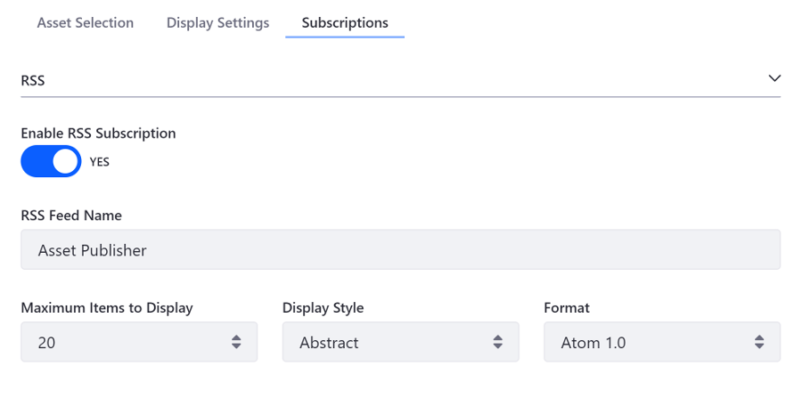

# Configuring Asset Publisher Subscriptions

The Asset Publisher application supports two kinds of subscriptions: RSS feed subscriptions, and  email subscriptions.

## RSS Feed Subscriptions

```note::
   RSS feeds are deprecated for Liferay Portal 7.2+ and are disabled by default. To leverage RSS feeds, you must enable this feature.
   
   1. Open the Product Menu and go to *Control Panel* &rarr; *Configuration* &rarr; *System Settings*.
   2. Select *Web Content* under the *Content and Data* heading.
   3. Under the *System Scope* &rarr; *Administration* tab, check the *Show Feeds* box. For more information on deprecated apps, see [this article](TODO).
```

To enable RSS feed subscriptions for the Asset Publisher, follow these steps:

1. Hover over the Asset Publisher and click the Options icon () in the widget's menu and select *Configuration*.

1. Toggle the *Enable RSS Subscription* selector to Yes.

1. Fill in the form and click *Save* to apply the changes.

  

1. Enable the *Subscribe* feature under the *Display Settings* tab &rarr; *Set and Enable*, if it's not already enabled.

Enabling RSS Subscription adds a RSS link to the Asset Publisher. Users wishing to be notified of newly published assets can click on this link to be added to subscribe to the RSS feed.

## Email Subscriptions

Users can subscribe to the Asset Publisher to receive email notifications when new assets are published. You must enable this notification first. Follow these steps:

1. Hover over the Asset Publisher and click the Options icon () in the widget's menu and select *Configuration*.

1. Toggle the *Enable Email Subscription* selector to Yes.

1. Fill in the form and click *Save* to apply the changes.

  

1. Enable the *Subscribe* feature under the *Display Settings* tab &rarr; *Set and Enable*, if it's not already enabled.

Enabling Email Subscription adds a *Subscribe* link to the Asset Publisher. Users wishing to be notified of newly published assets can click on this link to be added to the subscription list. 

Liferay Portal periodically checks for new assets and sends emails to subscribed users informing them about the new assets. By default, Liferay performs this check every twenty-four hours. You can change the check interval through System Settings. Follow these steps:

1. Open the Product Menu and go to *Control Panel* &rarr; *Configuration* &rarr; *System Settings*. 

1. Select *Assets* under the *Content and Data* heading.

1. Go to *System Scope* &rarr; *Asset Publisher*. 

1. Change the *Check Interval* setting to the interval (in hours) that you want to check for new assets and notify subscribed users, and click *Save* to apply the changes.