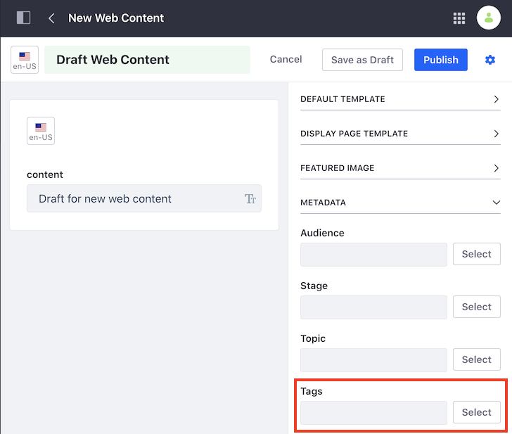
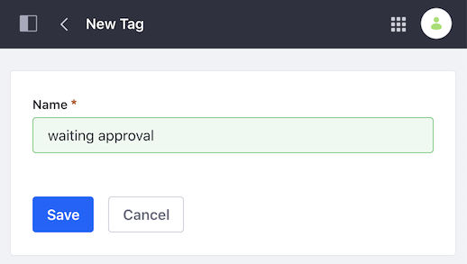

# Tagging Content

You can organize your content and make it easier for user to find the content they want using tags. Tags are words or phrases that you can attach to any content. When you tag content, your search results are more accurate, and you can use tools like the [Asset Publisher](../../../site-building/displaying-content/using-the-asset-publisher-widget.md) content in an organized way on a web page.

There are two ways to create content tags:

- On the fly, as you create new content.
- From the Tags administration page.


## Creating Tags for New Content

1. Start creating your new content.
1. On the sidebar panel, under the *Metadata* section, click *Select* next to *Tags*.
1. Select one or more tags for your content.
1. Click *Done*.



## Creating Tags from the Tags Administration Page

```note::
   Only site administrators can acccess the Tags Administration Page.
```

1. Open the Product Menu and go to the Site Menu &rarr; *Categorization* &rarr; *Tags*.
1. Click the *Add Tag* icon ()
1. Enter a *Name* for your tag.
1. Click *Save*.

```note::
   Liferay saves the tag name in lowercase letters.
```



In addition to tags, you can describe content using [Categories](./defining-categories-for-content.md)
