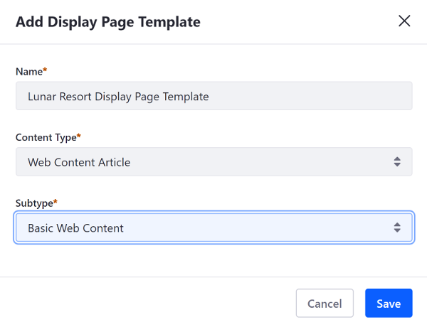
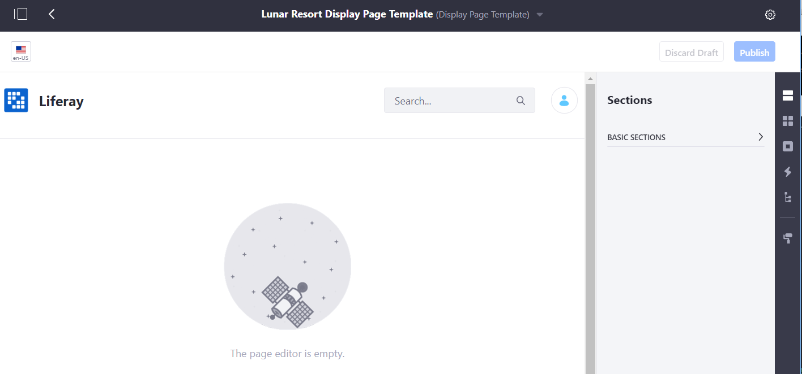

# Creating a Display Page Template

Follow these steps to create a Display Page Template:

1. Open the Product Menu and go to *Site Builder* &rarr; *Pages* under your site's menu.

1. Click the *Display Page Templates* tab.

1. Click the *Add* button ().

1. Give your Display Page Template a name and select a content type (Web Content articles, blogs, and documents are supported) and a Subtype if applicable, and click *Save*.

  

  

1. Now on the edit page for the Display Page Template, build the page as you would [build any other Content Page](../02-creating-pages/04-building-content-pages.md) using the available [Content Page elements](../02-creating-pages/03-content-page-elements.md). You can add any combination of Page Fragments---with and without editable content---to the page to build your design.

  

1. Click on an editable field (text area for example) and click the *Map* button () in the dialog that appears. You can map editable fields to a piece of content. You can also base it on a specific Web Content Structure.

  ```note::
    You can map any data or metadata from a Web Content Article or Structure to a Display Page Template. For the Basic Web Content type, this includes structure-defined fields like Summary, Title, and Content, as well as metadata fields like Publish Date, Categories, and Tags. In a user-defined structure, all user selected fields appear here as well. Custom fields are also available for display if they apply to the content type selected.
  ```

1. Select a field from the content type to map the editable Page Fragment to. The mapped field highlights purple to indicate that it's mapped.

  

1. Click *Publish* at the top of the page to save your work.

  ```note::
     You can go back and edit the display page template by navigating to *Site Administration* &rarr; *Site Builder* &rarr; *Pages* &rarr; *Display Page Templates* and clicking *Actions* () &rarr; *Edit* next to the display page template you want to edit. If you're viewing the published display page, you can also select the *Edit* button () from the Control Menu.
  ```

You now have a Display Page Template with static graphics and a text area that's replaced with whatever content you add to it.
Follow the steps in [Configuring Content to Use Display Page Templates](./03-configuring-content-to-use-display-pages.md) to configure your content to use a Display Page Template.
