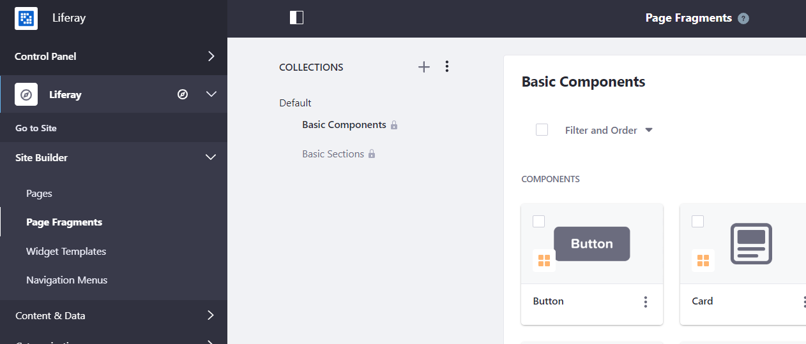

# Adding a Page Fragment

Page Fragments are organized in *Collections*. Collections can be used to differentiate between different types of Page Fragments or Page Fragments used by different groups or departments. Follow these steps to add a Page Fragment:

1. Make sure the Site where you want to work is selected. If you prefer creating a Page Fragment that's available for all Sites, since Liferay DXP 7.2 SP1+ and Liferay Portal 7.2 GA2+, you can create global Page Fragments. Navigate to the *Global* Site and create your Page Fragment there. 

  ```note::
    Global Page Fragments are available in Liferay DXP 7.2 SP1+ and Liferay Portal 7.2 GA2+. To expose this feature in the initial releases of these versions, you must create a `.config` file named  `com.liferay.fragment.web.internal.configuration.FragmentGlobalPanelAppConfiguration.config` and add the `enabled=B"true"` property. Then copy it to your Liferay Portal instance's `osgi/configs` folder. Global Page Fragments are inherited by child Sites, so they can only be edited from the Global Site. Any resources the Global Page Fragment references (e.g., image) from the Global Site are copied to a Site that leverages the Page Fragment.
  ```

1. Open the Product Menu and go to *Site Builder* &rarr; *Page Fragments* under the Site Menu. From the main Page Fragments page you can manage your Page Fragments and Collections. See [Managing Page Fragments](./managing-page-fragments.md) for more information on the available actions for Page Fragments.

1. Click the () button next to *Collections* heading to add a new Collection if one doesn't already exist, or select an existing custom Collection.

  

1. With the Collection selected, click the () under the new Collection's window to create a new Page Fragment.

    ```note::
      In Liferay DXP 7.3, Only Components are available. In Liferay DXP 7.2, you could create either a Section (a Fragment spanning the entire width of the row, such as a banner) or a Component (a smaller Fragment that can be combined with other Components to create more complex interactions, such as a button).
    ```

1. Give the Page Fragment a name and click *Save*.

1. [Develop the Page Fragment](../../developer-guide/developing-page-fragments/developing-fragments-intro.md) using [the editor](./the-page-fragments-editor.md) and publish the changes.

```note::
  You can also create Page Fragments outside of Liferay Portal using your own tooling. See `Developing a Page Fragment with the Fragments Toolkit <../../developer-guide/developing-page-fragments/developing-page-fragments-with-the-fragments-toolkit.md#collection-format>`_ for more information.
```