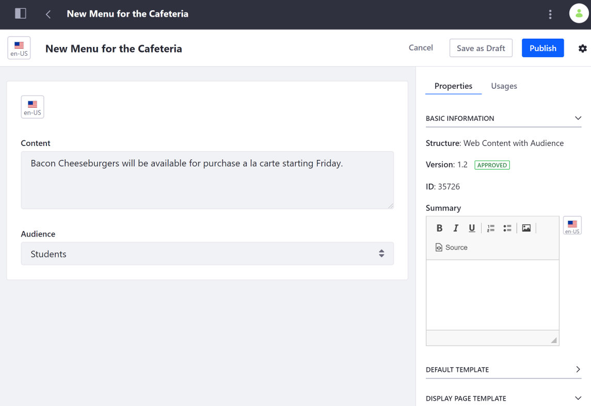
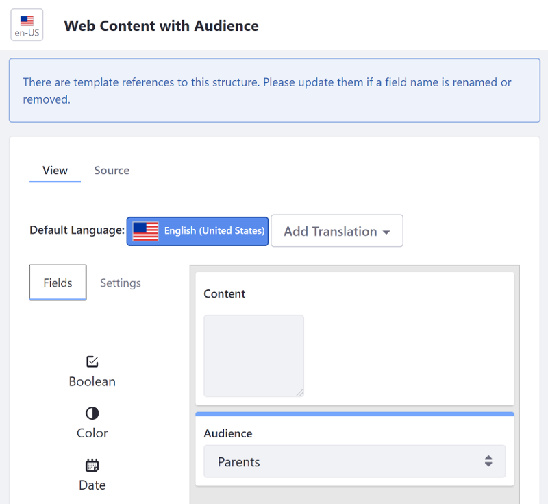
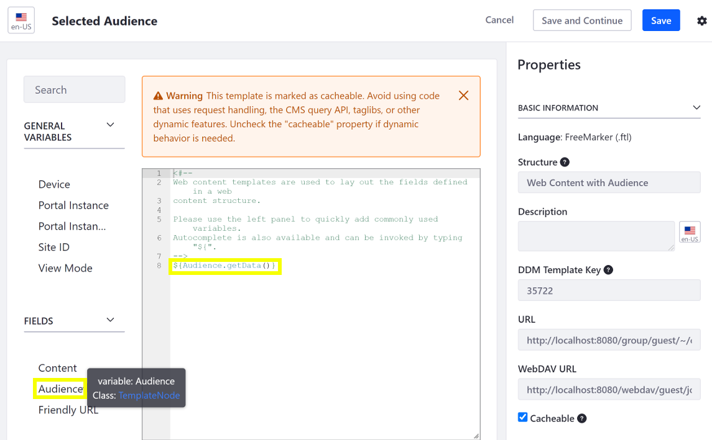
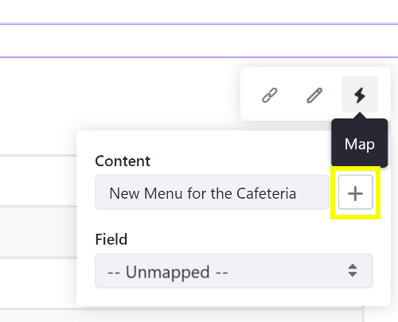
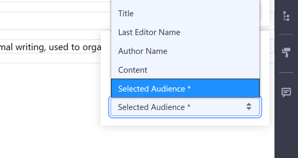

# Mapping Web Content Templates to Fragments

By default, the basic information and Structure fields for a Web Content article (Date, Decimal, Image, Number, Text, and TextBox) can be mapped to Fragments. To include other information, such as Select Field values, Radio Button values, or HTML, you must render the Web Content Structure field's value in a separate Web Content Template, then the Template can be mapped to a Fragment.

## Mapping a Web Content Template

The steps below show how to map a Web Content Template to a Fragment.

1. [Create a Web Content Template](../../../content-authoring-and-management/web-content/user-guide/web-content-templates/creating-a-web-content-template.md) that uses the same Structure as the Web Content Article that contains the field you want to map. For example, the Web Content Article below uses the Structure *Web Content with Audience*.

    

    The example *Web Content with Audience* Structure contains a Content field (TextBox) that can be mapped by default and an Audience field (Select field) that requires a separate Web Content Template to be mapped.

    

1. Render the Structure field in the Template by clicking its name under the *Fields* heading on the left side of the script window to add the variable.

    

1. On the Fragment-supported page (Content Page, Display Page Template, etc.) [add the Fragment](./building-content-pages.md#adding-elements-to-a-content-page) and click the [mappable element](./building-content-pages.md#mapping-content) to bring up its context menu.
1. Click the *Map* button () and click the add button () in the mapping dialog to select the Web Content Article that contains the value you want to map.

    

1. Once the Web Content is selected, select the Web Content Template you created from the list of mapping options in the selector. The Template appears with a `*` next to its name to indicate that it's a Template rather than a standard field.

    

1. Click *Publish* to save the changes. The Web Content's Template is mapped to the Fragment!

    

```note::
  If you want to make several structure field values available (that aren't included by default, as mentioned above) for mapping to individual Fragments, you must create a separate Web Content Template for each field that uses that Structure and renders just the one field. If you render all your fields in one Template, all their values will be mapped to the Fragment when you select the Template.
```