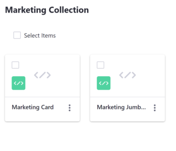

# Creating a Contributed Fragment Collection

Contributed Fragment Collections are deployable modules containing Page Fragments. The Fragments in a contributed Collection can be used just like regular Fragments, but aren't contained in the database.

```note::
  If you're running Liferay DXP 7.3+ `Automatically deployed Fragments <./auto-deploying-fragments.md>`_ created in compressed ZIP Collections (either `with your own tools <developing-page-fragments-with-the-fragments-toolkit.md#collection-format-overview>`_ or the `Liferay Fragments Toolkit <developing-page-fragments-with-the-fragments-toolkit.md>`_ should be used instead, as they are easier to maintain and can be modified from the UI.
```

This example uses a Docker image with a fresh install of Liferay DXP and runs on Liferay DXP 7.3+. 
 
```note::
  All Fragments added through a Contributed Fragment Collection are available globally to all Sites.
```

To add a contributed Fragment Collection, you extend the [`BaseFragmentCollectionContributor` Class](TODO), which itself implements the [`FragmentCollectionContributor` interface](TODO).

Here, you'll learn how to contribute a Fragment Collection:

1. [Examine a Contributed Fragment Collection](#examine-a-contributed-fragment-collection)
1. [Add the Fragment Resources](#add-the-fragment-resources)
1. [Include the Fragment Entry in the Collection JSON](#include-the-fragment-entry-in-the-collection-json)
1. [Deploy and Test](#deploy-and-test)

## Examine a Contributed Fragment Collection

First, deploy an example to see what a contributed Fragment Collection looks like:

1. Run the command below to start the Docker container:

    ```bash
    docker run -it -p 8080:8080 liferay/portal:7.3.0-ga1
    ```

1. Download and unzip the [Marketing Fragment Collection](https://github.com/liferay/liferay-learn/tree/master/docs/dxp/7.x/en/site-building/developer-guide/developing-fragments/creating-a-contributed-fragment-collection/liferay-l3m9.zip):

    ```bash
    curl https://github.com/liferay/liferay-learn/tree/master/docs/dxp/7.x/en/site-building/developer-guide/developing-fragments/creating-a-contributed-fragment-collection/liferay-l3m9.zip

    unzip liferay-l3m9.zip
    ```

1. Build the contributed Collection's JAR.

    ```bash
    cd contributed-marketing-fragments-collection
    ./gradlew build
    ```

1. Copy the contributed Collection's JAR to the Docker container:

    ```bash
    cp com.liferay.learn.fragments-1.0.0.jar docker-container-name:/path/to/deploy/folder
    ```

1. Confirm the deployment to the Liferay Docker container console. The log message below should appear in the Docker console:

    ```bash
    INFO  [fileinstall-/opt/liferay/osgi/modules][BundleStartStopLogger:39] STARTED com.liferay.learn.fragments_1.0.0 [1121]
    ```

1. Verify that the contributed Collection and Fragment are available. Open your browser to `https://localhost:8080`, and open the Product Menu and go to *Site Builder* &rarr; *Page Fragments* under the Site Menu.

    

Great! You successfully deployed a contributed Fragment Collection.

As you can see, the contributed Fragment Collection is listed with the other default Fragment Collections and the Fragments can't be modified from the UI. The only way to modify the Collection is to either update the module they came from or [copy the Fragment to another Collection](../../04-fragments/managing-page-fragments.md#managing-individual-page-fragments) and modify the Fragment copy.

## Contributed Fragment Collection Logic and metadata

The Fragment Collection contributor overrides a couple methods in the `*FragmentCollectionContributor` Class to provide information about the Collection.

The `getFragmentCollectionKey()` method returns the key/name of the Fragment Collection to contribute the Fragments to:

```java
@Override
public String getFragmentCollectionKey() {
    return "Marketing Collection";
}
```

The `getServletContext()` method returns the servlet context for the contributed Fragment Collection module:

```java
@Override
public ServletContext getServletContext() {
    return _servletContext;
}
```

The `ServletContext` points to the bundle's symbolic name so it can find the Fragment resources: 

```java
@Reference(
  target = "(osgi.web.symbolicname=com.liferay.learn.fragments)"
)
private ServletContext _servletContext;
```

The `bnd.bnd` file includes a few properties that must be defined for the Collection:

* The `osgi.web.symbolicname` matches the `Bundle-SymbolicName` in the bnd.bnd file.
* The `Web-ContextPath` Header indicates the module folder that contains the Collection, so the `ServletContext` is correctly generated.
* The `-dsannotations-options` instruction specifies to use Declarative Service annotations found in the class hierarchy of the Component class. 

See the example project's [bnd.bnd](https://github.com/liferay/liferay-learn/tree/master/docs/dxp/7.x/en/site-building/developer-guide/developing-fragments/creating-a-contributed-fragment-collection/liferay-l3m9.zip) for a reference of these values.

Now you'll modify the project to include another Fragment in the contributed Collection.

## Add the Fragment Resources

To include a Fragment in the contributed Collection, it must be included in a folder structure that mirrors the `*FragmentCollectionContributor` class package with a `/dependencies` folder appended to the end. The example has the structure `resources/com/liferay/learn/fragments/dependencies/`.

Add a new packaged Fragment into the `dependencies` folder. To save time, you can move the `liferay-l3m9/marketing-jumbotron` folder in the example's ZIP file into the `resources/com/liferay/learn/fragments/dependencies/` folder. See [Developing Page Fragments with the Fragments Toolkit](./developing-page-fragments-with-the-fragments-toolkit.md) for more information on creating Fragments.

```note::
    The class package name and resources package name must match (e.g. ``[my.class.package.structure].dependencies``).
```

## Include the Fragment Entry in the Collection JSON

Besides including the packaged Fragment, you must also include its entry in the Collection's metadata. In the `collection.json` in the `[my.class.package.structure].dependencies` folder, add the marketing jumbotron Fragment to the `fragments` entry, as defined in the Fragment's `fragment.json` `fragmentEntryKey` entry:

    ```json
    {
        "fragments": [
            "marketing-card",
            "marketing-jumbotron"
        ],
        "name": "Marketing Collection"
    }
    ```

```note::
  Contributed Fragment Collections do not support `included resources <./including-default-resources-with-fragments.md>`_.
```

## Deploy and Test

You can build and deploy the updated contributed Fragment Collection as you did above:

1. Build the updated contributed Collection's JAR.

    ```bash
    cd contributed-marketing-fragments-collection
    gradlew build
    ```

1. Copy the updated JAR to the Docker container:

    ```bash
    cd build/libs
    cp com.liferay.learn.fragments-1.0.0.jar docker-container-name:/path/to/deploy/folder
    ```

1. Verify that the updated Fragment is included in the contributed Collection. Open your browser to `https://localhost:8080`, and open the Product Menu and go to *Site Builder* &rarr; *Page Fragments* under the Site Menu.

    

## Conclusion

Congratulations! You now know how to create a contributed Fragment Collection, and have added a new contributed Fragment Collection to Liferay DXP.

## Related Information

* [Developing Page Fragments with the Fragments Toolkit](./developing-page-fragments-with-the-fragments-toolkit.md)
* [Developing Page Fragments with the Editor](./developing-page-fragments-with-the-editor.md)