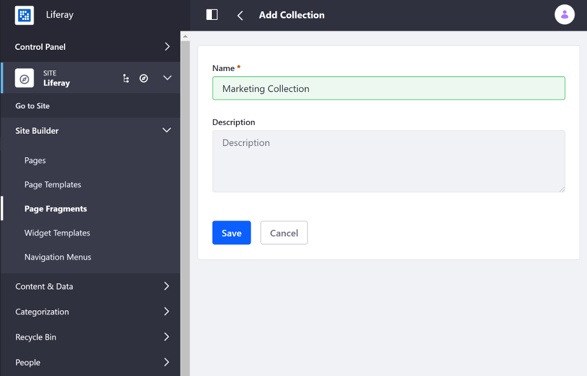
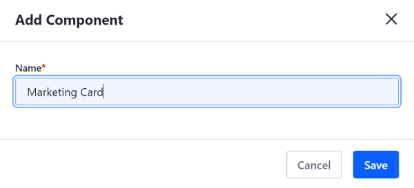
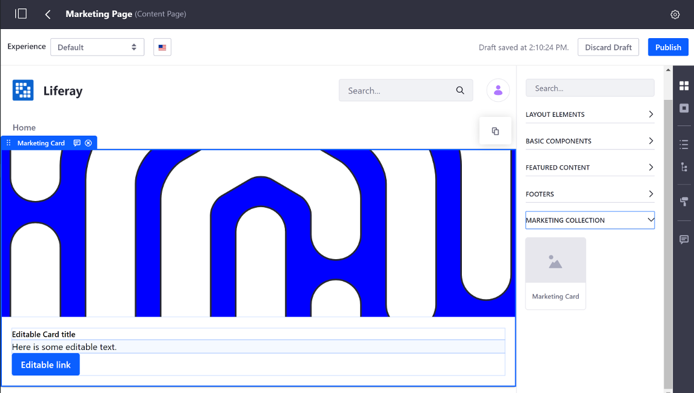

# Developing Page Fragments in the built-in Fragments Editor

The built-in [Page Fragments editor](./reference/page-fragment-editor-interface-reference.md) has all the tools you need to develop Page Fragments inside Liferay Portal. Page Fragments are organized in *Collections*. Collections differentiate between types of Page Fragments or Page Fragments used by different groups or departments. You can use the editor to create Page Fragments in just a few steps:

1. Start Docker.
1. Create a Collection.
1. Create a Fragment in the Collection.
1. Create the HTML component.
1. Create the CSS component.
1. Create the JavaScript component.
1. Publish the Fragment.

This example uses a Docker image with a fresh install of Liferay DXP.

## Start Docker

Open the command line and run the command below to start the Docker container:

```bash
docker run -it -p 8080:8080 liferay/portal:7.3.0-ga1
```

## Create a Collection
  
1. Select the Site you wish to build.

  ```note::
    Since Liferay DXP 7.2 SP1+ and Liferay Portal CE 7.2 GA2+, you can create Page Fragments on the *Global* Site to make them available for all Sites. To expose this feature in the initial releases of these versions, you must create a ``.config`` file named ``com.liferay.fragment.web.internal.configuration.FragmentGlobalPanelAppConfiguration.config`` and add the ``enabled=B"true"`` property. Then copy it to your Liferay Portal instance's ``osgi/configs`` folder. Global Page Fragments are inherited by child Sites, so they can only be edited from the Global Site. Any resources the Global Page Fragment references (e.g., image) from the Global Site are copied to a Site that leverages the Page Fragment.
  ``` 

1. Open the Product Menu and go to Site &rarr; *Site Builder* &rarr; *Page Fragments*. From this page you can manage your Page Fragments and Collections. See [Managing Page Fragments](../../using-fragments/managing-page-fragments.md) for more information on the available actions for Page Fragments.
1. Click the () and enter a name and optional description for the Collection.

    

## Create a Fragment in the Collection

1. With the Collection selected, click the [] in the Collection to create a new Fragment [Component](../../creating-pages/content-pages-overview.md#basic-components). 

    ```note::
      Prior to Liferay DXP 7.3, a Fragment could either be a Section or a Component. In Liferay DXP 7.3+, all Page Fragments are Components.
    ```

1. Enter a name for the Fragment and click *Save*.

    
    
Next you can create your Fragment's HTML.

## Create the HTML Component

Write the HTML in the HTML pane:

```html
<div class="banner py-6 py-md-8 text-white" data-lfr-background-image-id="banner">
    <div class="container my-lg-6">
        <div class="row">
            <div class="col-12 col-md-8 col-xl-6">
                <h1>
                    <lfr-editable id="01-title" type="rich-text">
                        Banner Title Example
                    </lfr-editable>
                </h1>

                <div class="mb-4 lead">
                    <p>
                        <lfr-editable id="02-subtitle" type="rich-text">
                            This is a simple banner component that you can use to provide extra information.
                        </lfr-editable>
                    </p>
                </div>

                <lfr-editable id="03-link" type="link">
                    <a href="#" class="btn btn-primary">Go Somewhere</a>
                </lfr-editable>
            </div>
        </div>
    </div>
</div>
```

## Create the CSS Component

Write the CSS in the CSS pane (Replace `.fragment_number` with the class for your Component):

```css
.fragment_number .banner {
    background-color:#415fa9;
    background-position: center;
    background-size: cover;
}
```

## Create the JavaScript Component

Write the JavaScript in the JavaScript pane:

```javascript::
console.log('The Fragment has been loaded on the page');
```


## Publish the Fragment

Click *Publish* to save your work and make it available to add to a [Content Page](../../creating-pages/understanding-pages.md#content-pages).



## Related Information

* [Developing Page Fragments with the Fragments Toolkit](./developing-page-fragments-with-the-fragments-toolkit.md)
* [Making a Page Fragment Configurable](./making-a-page-fragment-configurable.md)