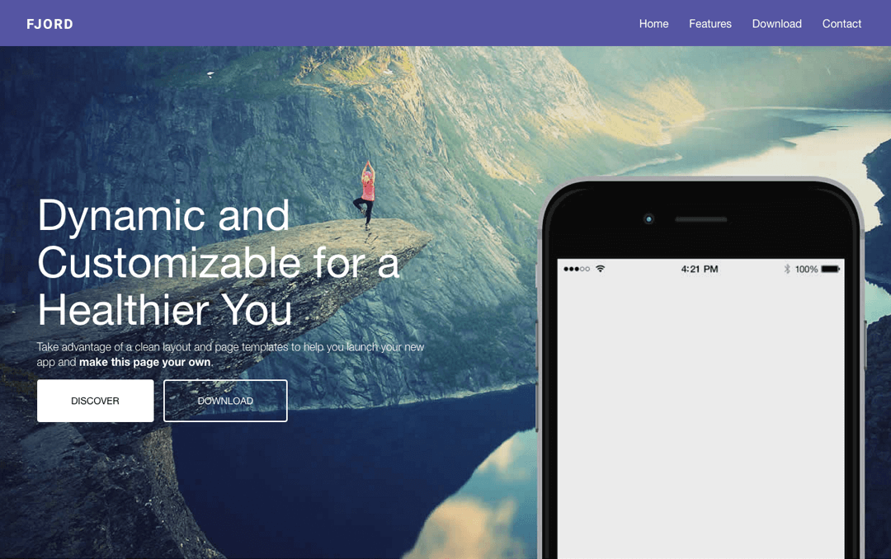

# Installing the Liferay Theme Generator

The Theme Generator is a handy CLI tool in the Liferay JS Themes Toolkit that creates the required files and structure you need to get started with liferay DXP Theme development. It provides several sub-generators for creating Themes, extending Themes, and generating Layout Templates.



The steps below show how to install the Liferay Theme Generator for your development environment.

1. Install the version of [NodeJS](http://nodejs.org/) (along with Node Package Manager(npm)) that corresponds with your version of Liferay DXP:

    | Liferay Portal Version | Supported Node Version |
    | --- | --- |
    | 7.0.x | 6.6.0 |
    | 7.1.x | 8.10.0 |
    | 7.2.x | 10.15.1 |
    | 7.3.x | 10.15.1 |

    For instance, Liferay Portal 7.2 supports [v10.15.1](https://nodejs.org/download/release/v10.15.1/). Make sure to properly [set up your npm environment](./setting-up-your-npm-environment-reference.md).

    ```note::
      Gulp 4 and Node v12 are supported in Liferay JS Themes Toolkit v10.x.x. Unless you have a reason not to switch to 10.x.x (e.g. you need to migrate custom gulp tasks from 3 to 4), you should use version 10.x.x. 
    ```

1. Use npm to install the [Yeoman](http://yeoman.io/) dependency:

    ```bash
    npm install -g yo
    ```

    ```note::
      In Liferay JS Themes Toolkit v7.x.x and v8.x.x, Gulp is included as a local dependency in generated themes, so you aren't required to install it. It can be accessed by running ``node_modules\.bin\gulp`` followed by the Gulp task from a generated theme's root folder. In v9.5.0+ the gulp tasks are available as npm scripts and can be run as ``npm run [command]``.
    ```

1. Install the Liferay Theme Generator with the command that matches the Liferay Portal version you want to develop on:

    | Liferay Version | Liferay Theme Generator Version | Command |
    | --- | --- | --- |
    | 6.2 | 7.x.x | `npm install -g generator-liferay-theme@7.x.x` |
    | 7.0 | 7.x.x or 8.x.x | Same as above or below |
    | 7.1 | 8.x.x | `npm install -g generator-liferay-theme@8.x.x` |
    | 7.2 | 9.x.x or 10.x.x | `npm install -g generator-liferay-theme@9.x.x` |
    | 7.3 | 9.x.x or 10.x.x | `npm install -g generator-liferay-theme@10.x.x` |
    
    See [compatibility](https://github.com/liferay/liferay-js-themes-toolkit#compatibility) for more information.

    If you're on Windows, follow the instructions in step 4 to install Sass.

1. The generator uses node-sass. If you're on Windows, you must also install [node-gyp and Python](https://github.com/nodejs/node-gyp#installation).

## Generator and Sub-generator Commands

The Theme Generator has several sub-generators available that you can use. The available sub-generators are listed in the table below:

| command | description | Generator Version |
| --- | --- | --- |
| `yo liferay-theme` | Generates a Theme based on the Styled base Theme | All versions |
| `yo liferay-theme:classic` | Generates a Theme based on the Classic Theme | 9.5.0+ |
| `yo liferay-theme:admin` | Generates an Admin Theme based on the Control Panel's Admin Theme | 9.5.0+ |
| `yo liferay-theme:themelet` | Generates a Themelet to extend a Theme | All versions |
| `yo liferay-theme:layout` | Generates a Layout Template | All versions |
