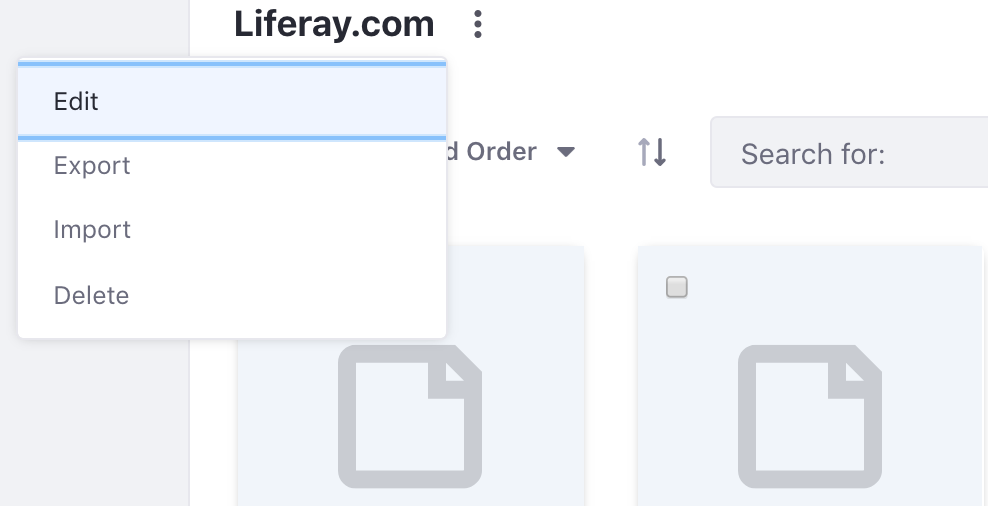

# Managing Page Fragments

As your Site grows, you'll have many Collections of Page Fragments. You can organize them in any way you wish: 

* You can edit them directly.
* You can export and import them. 
* You can move and copy Fragments between Collections. 

These functions and more are described below. 

## Managing Collections of Page Fragments

To access the collections management menu, follow these steps:

1. Open the Product Menu and go to *Site Builder* &rarr; *Page Fragments* under the Site menu.

1. Select the Collection you want to manage from the *Collections* list.

1. Open the () menu next to the Collection name.

1. Select an action for the Collection:

**Edit**: change the name or description for the collection.

**Export**: Download a `.zip` file containing all Page Fragments in the Collection without exporting any Collection data. To export the Collection with Collection data, select the *Export* option from the Actions Menu next to the *Collections* heading and select a Collection or multiple Collections to export. Each collection exports in a separate `.zip` file.

**Import**: Select a `.zip` file to upload with additional Page Fragments. If you want to replace an existing collection, make sure the box is checked for *Overwrite Existing Files*. You can import a Collection that was created in Liferay Portal, a Collection created using external tools, or Page Fragments without a Collection.

```note::
Exporting and importing Page Fragments is the preferred way to share code or bring it into your Site.
```

**Delete**: Remove the current collection and all its contents.



## Managing Individual Page Fragments

To access the Page Fragment management menu, follow these steps:

1. Open the Product Menu and go to *Site Builder* &rarr; *Page Fragments* under the Site menu.

1. Select the Collection containing the Page Fragment you want to manage from the *Collections* list.
 
1. Open the () menu next to the Page Fragment.

1. Select An action:

**Edit**: Modify the Page Fragment's code and configuration.

**Rename**: Change the Page Fragment's name.

**Move**: Move the Page Fragment to a different Collection.

**Make a Copy**: Duplicate the Page Fragment. Duplicated Page Fragments share the same name with *(Copy)* appended to the end.

**Change Thumbnail**: Change the thumbnail image for the Page Fragment.

**Export**: Download a `.zip` file of the Page Fragment.

**Delete**: Remove the Page Fragment from the Collection.

```note::
  You can't edit a default Page Fragment. However, you can copy the default Page Fragment and move it to your custom Collection and edit it there. To do this, navigate to the default Page Fragment Collection and open the Page Fragment's *Actions* () Menu and select *Copy To*. Then select the Collection to copy the default Page Fragment to. Copying default Page Fragments is available in Liferay DXP 7.2 SP1+ and Liferay Portal 7.2 GA2+.
```
