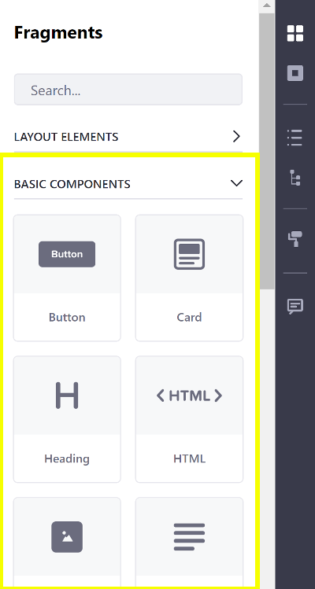

# Page Fragments

Page Fragments are chunks of HTML, CSS, and JavaScript that when combined together, build [Content Pages](../../creating-pages/content-pages-overview.md). Each Page Fragment adds functionality to the page. Several default Page Fragments that you can use to build basic page elements such as carousels and cards ship with Liferay DXP.

You may, however, require custom fragments. You can create your own Page Fragments using the built-in [Page Fragment editor](../../developer-guide/developing-page-fragments/reference/page-fragment-editor-interface-reference.md), or locally from your desktop with the [Fragments Toolkit](../../developer-guide/developing-page-fragments/developing-page-fragments-with-the-fragments-toolkit.md). For a deeper dive into creating a custom Page Fragment, see [Developing Page Fragments](../../developer-guide/developing-page-fragments/developing-fragments-intro.md).

Developers can also [embed Liferay widgets](../../developer-guide/developing-page-fragments/reference/fragment-specific-tags-reference.md#including-widgets-within-a-fragment) and add fields containing text and images. You can use these during the final Content Page publication process to provide your own content. 

Page Fragments are organized into Collections. Collections group related Fragments together so you can manage them easily. Fragments are accessible through these Collections when [building a Content Page](../../creating-pages/building-content-pages.md). You can include resources in Page Fragment Collections and reference them from your Page Fragment's code without worrying about their availability. This is helpful when moving Page Fragments. See [Including Default Resources in Page Fragments](../../developer-guide/developing-page-fragments/including-default-resources-with-fragments.md) for more information.

<!-- Please modify the image below so that the Collection and Fragment displayed are real world examples, not My Collection and My Fragment. --> 

These topics are covered:

* [Managing Page Fragments](./managing-page-fragments.md)
* [Propagating Page Fragment Changes](./propagating-page-fragment-changes.md)
