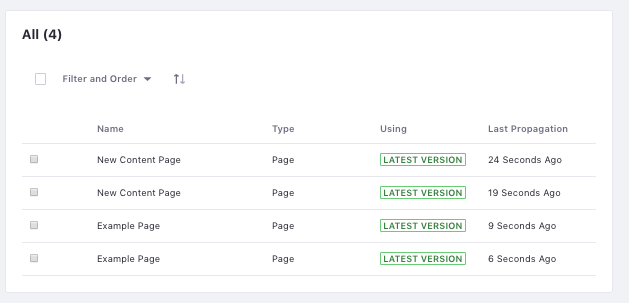
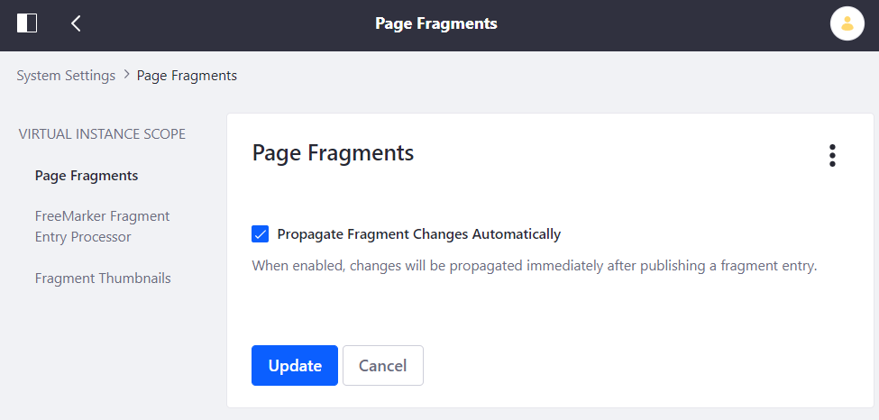

# Propagating Page Fragment Changes

By default, Updates made to Page Fragments aren't automatically propagated to the [Content Pages](../../creating-pages/content-pages-overview.md), [Content Page Templates](../../creating-pages/creating-a-page-template.md), and [Display Pages](./creating-a-display-page-template.md) that use them. You must manually propagate the changes. However, you can enable automatic propagation for testing purposes. See the [Enabling Automatic Page Fragment Propagation](#enabling-automatic-page-fragment-propagation) section below for more information.

## Manually Propagating Page Fragment Changes

Follow these steps to manually propagate your Page Fragment changes:

1. Open the Product Menu and go to *Site Builder* &rarr; *Page Fragments* under the Site Menu.

1. Select the Collection containing the changed Page Fragment.

1. Open the *Actions* menu () for the Page Fragment and select *View Usages*.

  ```note::
    You can propagate changes from global Page Fragments to their usages on child Sites. Select *View Site Usages* from the Page Fragment's Actions Menu in the Global Site.
  ```

1. From the *Usages and Propagation* page, check the box for the Content Page(s), Content Page Template(s), and Display Page(s) that you want to propagate Page Fragment changes to. You can use the various filters and selection options to apply updates to pages quickly.

  

1. Click the *Propagate* icon () to propagate your changes.

```note::
  Changes to existing `editable` fields are not propagated since this overwrites content currently in content pages. To force propagation to content in an `editable` field, you must change the field ID. Any content created in that field no longer appears in the Content Page when the changes are propagated, but it remains in the database and can be retrieved using the old ID.
```

## Enabling Automatic Page Fragment Propagation

During development testing, manually propagating Page Fragment changes can be tedious. For development purposes, since Liferay DXP 7.2 SP1+ and Liferay Portal CE GA2+, you can enable automatic Page Fragment propagation.

```note::
  Automatic Page Fragment propagation should only be enabled for development testing, as automatic propagation can lead to unintended consequences in the production environment. Automatic propagation only works for HTML, CSS, and JavaScript Page Fragment code, not the editable values.
```

Follow these steps to enable automatic Page Fragment propagation:

1. Open the Product Menu and select *Configuration* &rarr; *System Settings* under the *Control Panel* heading.

1. Click *Page Fragments* under the Content and Data heading.

1. Enable the *Propagate Fragment Changes Automatically* setting and click *Save* to apply the change.



Your Page Fragment updates are now automatically propagated! The Page Fragment Editor displays a notification that automatic Page Fragment propagation is enabled.

